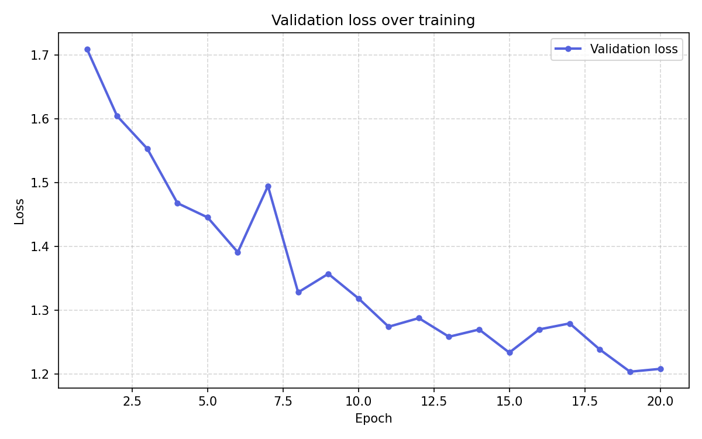
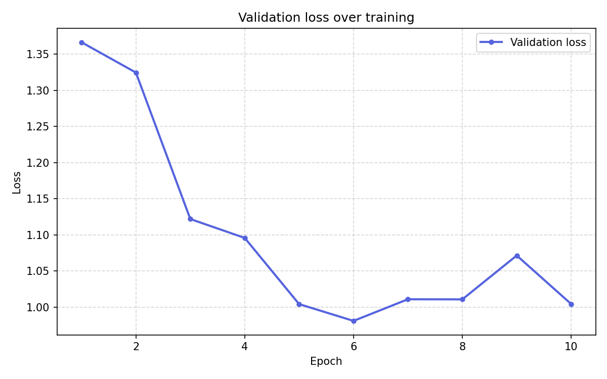
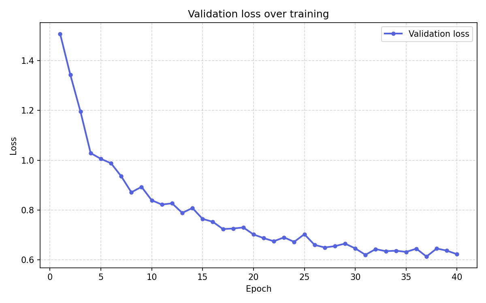
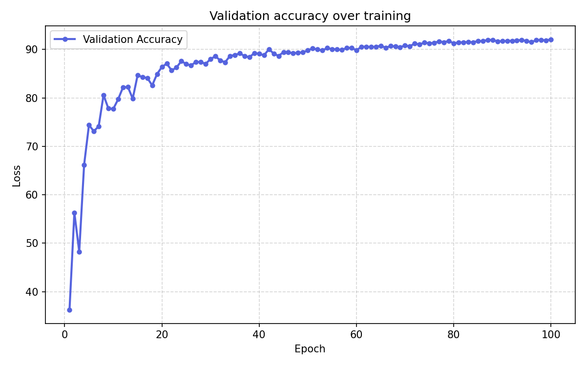

# CIFAR-10 Classification

Using neural networks to classify 32x32 images into 10 classes in the CIFAR-10 Database.

---

## Results

**Before tuning**

Accuracy: 55.96%

**After 1st tuning**

Accuracy: 65.96%

**After 2nd tuning**

Accuracy: 78.89%

**After 3rd tuning**

Accuracy: 92.42%

---
### Methodology

I started off by using a few convolutional blocks with very medium sized parameters. 
In the 1st tuning, I expanded the number of generations to allow the model to fully train without a bottleneck.
In the 2nd tuning, the parameters were still quite small, ending at only 32 channels when the convolutional blocks were finished.
In the 3rd tuning, I added a learning rate scheduler (cosine annealer), switched to a VGG style cnn, increased the convolutional blocks both in size and number, implemented data augmentation, removed the adapative average pool, added dropout, and increased the number of generations to fit the learning rate scheduler.
